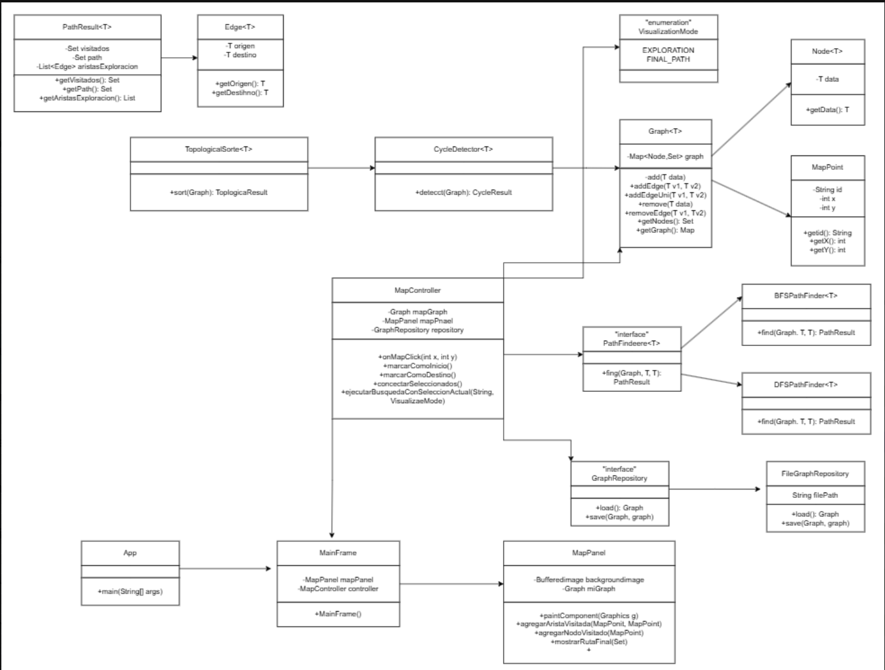

## Estructura de datos

# **Informe Del Proyecto: Implementación y Visualización de rutas en un mapa de calles mediante BFS y DFS**


## _**Nombre de Integrantes:**_

- Nataly Jiménez Salazar 
- Correo institucional:
njimenezs1@est.ups.edu.ec

- Evelyn Mayancela
- Correo institucional:
emayancelap@est.ups.edu.ec

- Michelle Marca
- Correo institucional:
amarca@est.ups.edu.ec

## **Fecha Inicio:** 17/17/2026

## **Fecha Entrega:** 29/07/2026

## _**Objetivo General:**_

_Diseñar e implementar un sistema en Java que permita representar un mapa urbano mediante un grafo de nodos y
encontrar el mejor camino entre dos puntos utilizando los algoritmos ``BFS`` y ``DFS``, aplicando los principios de la
programación orientada a objetos y las estructuras de datos estudiadas en la asignatura._

## **_Objetivos Específicos:_**
1. Modelar los elementos del mapa (puntos, nodos y conexiones) mediante clases y estructuras de datos
adecuadas.
2. Implementar los algoritmos de búsqueda ``BFS`` y ``DFS`` sobre una estructura de grafo genérica.
3. Permitir la creación interactiva de nodos y conexiones (unidireccionales o bidireccionales) sobre la imagen
de un mapa.
4. Desarrollar una interfaz gráfica que permita visualizar el mapa, los nodos, las conexiones y el camino
resultante.
5. Persistir la información del grafo generado para que pueda reutilizarse en sesiones posteriores.

## Descripción de los métodos


``DFS PathFinder:`` 
El algoritmo ``DFS`` explora el grafo avanzando lo más posible por una rama antes de retroceder utilizando ``(LIFO)`` o recursividad. A diferencia de ``BFS``, ``DFS`` no garantiza el camino más corto, pero resulta útil para explorar todas las rutas posibles o verificar la conexión entre nodos.

``BFS PathFinder:`` 
El algoritmo ``BFS`` explora el grafo nivel por nivel, visitando primero todos los nodos vecinos del nodo actual antes ir a los siguientes, utiliza ``(FIFO)`` para gestionar el orden de visita. Cuando todas las conexiones tienen el mismo costo, ``BFS`` garantiza encontrar el camino más corto entre el nodo de inicio y el nodo de destino.
 
## **Tecnologias utilizadas:**

- Se utilizo Java como el lenguaje padre de la programacion del proyecto.
- Utilizacion de Java Swing para la GUI del escritorio(JFrame, JPanel, JPopupMenu, Graphics2D).
- Respectivas colecciones:
- Map, Set, List, LinkedHashMap, LinkedHashSet.
- Finalmemte el uso del MVC:
Donde esta nuestros modelo, controlador y vista.

## **Resultados obtenidos:**

*Tabla #1: Comparación de ``BFS`` y ``DFS``*

| Caso | Algoritmo | Inicio | Destino | Nodos Visitados | Cantidad Aristas | Tiempo |
| ---- |-----------|--------|---------|-----------------|------------------|--------|
|1     |     BFS   |  axa   | loni    |    10           |  2               | 4 ms   |
|1     |     DFS   |  axa   | loni    |    37           |   23             | 0 ms   |
|2     |      BFS  |A007    | A001    |    17           |  3               | 1 ms   | 
|2     |      DFS  |A007    | A001    |    19           |  4               | 0 ms   |       
|3     |      BFS  |xi      | haya    |    14           |  2               | 2 ms   |
|3     |    DFS    |xi      | haya    |    23           |  15              | 0 ms   |


_Figura 1. Exploración BFS: Caso 1 (axa a loni)_


_Figura 2. Exploración DFS: Caso 1 (axa a loni)_


_Figura 3. Exploración BFS: Caso 2 (A007 a A001)_


_Figura 4. Exploración DFS: Caso 2 (A007 a A001)_


_Figura 5. Exploración BFS — Caso 3 (xi a haya)_


_Figura 6. Exploración DFS — Caso 3 (xi a haya)_

## **Grafica UML del proyecto :**

_Figura 7. UML_

## **Arquitectura y estructura de carpetas**

El proyecto sigue el patrón **Modelo - Vista - Controlador (MVC)**, separando la lógica de datos, la lógica de negocio y la interfaz gráfica en paquetes independientes:

- **Modelo (`models`)**: representa los datos puros del dominio, sin ninguna lógica de interfaz. Contiene `MapPoint` (un nodo del mapa con id, x, y) y `VisualizationMode` (enum que define si la animación muestra toda la exploración o solo la ruta final).
- **Estructuras de datos (`structures`)**: contiene el grafo genérico y los algoritmos de búsqueda, completamente independientes de Swing. Se divide en:
  - `structures.node`: la clase `Node<T>`, que envuelve cualquier dato dentro del grafo.
  - `structures.graphs`: `Graph<T>` (el grafo mismo), `Edge<T>` (una arista dirigida), `PathResult<T>` (resultado de una búsqueda), `PathFinder<T>` (interfaz que define el contrato de todo algoritmo de búsqueda).
  - `structures.implementations`: las implementaciones concretas — `BFSPathFinder`, `DFSPathFinder`.
- **Persistencia (`persistence`)**: `GraphRepository` es la interfaz que define cómo guardar/cargar un grafo; `FileGraphRepository` la implementa guardando en un archivo de texto plano con secciones `[NODOS]` y `[ARISTAS]`.
- **Controlador (`controllers`)**: `MapController` es el intermediario entre la vista y los datos — recibe los clics del usuario, decide qué algoritmo ejecutar, actualiza el grafo y le indica a la vista qué dibujar.
- **Vista (`views`)**: `MainFrame` (ventana principal, barra de botones y menú flotante) y `MapPanel` (el lienzo donde se dibuja el mapa, los nodos, las aristas y la animación de búsqueda).
- **Punto de entrada (`App`)**: `App.java` contiene el `main` que arranca la aplicación.

Esta separación permite, por ejemplo, agregar un nuevo algoritmo de búsqueda creando una clase que implemente `PathFinder`, sin tocar ni una línea de la interfaz gráfica.

### Estructura de carpetas

```
icc-est-Proyecto-Final/
├── src/
│   ├── App/
│   │   ├── App.java                     # Punto de entrada (main)
│   │   └── PrototipoMenu.java           # Prototipo aislado del menú flotante
│   │
│   ├── models/
│   │   ├── MapPoint.java                # Nodo del mapa (id, x, y)
│   │   └── VisualizationMode.java       # Enum: EXPLORATION | FINAL_PATH
│   │
│   ├── structures/
│   │   ├── node/
│   │   │   └── Node.java                # Envoltorio genérico de un dato en el grafo
│   │   │
│   │   ├── graphs/
│   │   │   ├── Graph.java               # Grafo genérico (mapa de adyacencia)
│   │   │   ├── Edge.java                # Arista dirigida (origen -> destino)
│   │   │   ├── PathFinder.java          # Interfaz: contrato de búsqueda
│   │   │   ├── PathResult.java          # Resultado de una búsqueda
│   │   │   ├── CycleResult.java         # Resultado de detección de ciclos
│   │   │   └── TopologicalResult.java   # Resultado de orden topológico
│   │   │
│   │   └── implementations/
│   │       ├── BFSPathFinder.java       # Búsqueda en anchura
│   │       ├── DFSPathFinder.java       # Búsqueda en profundidad
│   │       ├── CycleDetector.java       # Detección de ciclos (DFS)
│   │       └── TopologicalSorter.java   # Orden topológico (Kahn)
│   │
│   ├── persistence/
│   │   ├── GraphRepository.java         # Interfaz: contrato de persistencia
│   │   └── FileGraphRepository.java     # Guarda/carga el grafo en archivo de texto
│   │
│   ├── controllers/
│   │   └── MapController.java           # Conecta la vista con el grafo y los algoritmos
│   │
│   └── views/
│       ├── MainFrame.java               # Ventana principal + barra lateral + menú flotante
│       └── MapPanel.java                # Lienzo: dibuja mapa, nodos, aristas y animación
│
├── resources/
│   └── maps/
│       └── map.png                      # Imagen de fondo del mapa
│
├── config/
│   └── mapa.json                        # Grafo guardado (nodos y aristas)
│
├── bin/                                  # Clases compiladas (.class)
├── .gitignore
└── README.md
```

## **Ánalisis Requerido: Preguntas hechas en base a las pruebas:**

``Costo``: No hace referencia a dinero, si no, cuan caro es realmente recorrer la conexión establecida (tiempo, distancia o dificultad/restricción del paso)

- ``¿Qué diferencias se observaron en el orden de exploración de BFS y DFS?``
En las tres pruebas, BFS exploró por anchura y llegó al destino visitando entre 10 y 17 nodos. mientras que DFS se comprometió con una rama profunda antes de retroceder, visitando siempre más nodos que BFS: 19 a 37.

- ``¿BFS encontró una ruta con menor cantidad de aristas en todos los casos evaluados?``
Sí, en los tres casos: 
Caso #1 (2 vs 23 aristas). 
Caso #2 (3 vs 4 aristas). 
Caso #3: 2 vs 15 aristas. 
BFS encontró consistentemente la ruta más corta o igual de corta.

- ``¿DFS encontró rutas diferentes a las obtenidas con BFS?``
Sí, en las tres pruebas ejecutadas, las rutas fueron distintas, el recorrido en los casos Nro. 1 y Nro. 3 fue más largo, mientras que en el caso Nro. 2 la diferencia fue menor (4 vs 3 conexiones), lo que muestra que la ventaja de BFS es más marcada cuando el destino está lejos en la estructura de exploración de DFS.

- ``¿Qué algoritmo visitó más nods en cada caso?`` 
El algoritmo DFS visitó, en los tres casos: 
37 vs 10, 
19 vs 17, 
23 vs 14.

- ``¿Los tiempos de ejecución fueron suficientes para determinar cuál algortimo es mejor?``
No, los tiempos son de 0 a 4 ms, prácticamente inapreciables porque el grafo es pequeño. No sirven para comparar rendimiento, pero lo que sí podemos considerar como un respaldo en los tres casos, es la cantidad de nodos visitados y conexiones en la ruta, donde BFS fue mejor en los tres.

- ``¿Cómo influyó la estructura del grafo en el comportamiento de cada algoritmo?``
Cuando el destino estaba "cerca" en términos de niveles de conexión (los Casos Nro. 1 y Nro. 3), BFS lo encontró casi de inmediato mientras DFS se desviaba por otras calles. Cuando el destino estaba en una zona más densamente conectada cerca del punto de inicio (el Caso 2), la diferencia entre ambos algoritmos se estabilizó, o sea que fue más fácil ver como trabajaban.

- ``¿Qué ventajas aporta separar la lógica del algoritmo de la visualización?``
Separar la lógica de búsqueda: PathFinder, BFSPathFinder, DFSPathFinder de la interfaz gráfica: MapPanel y MainFrame, permite que cada algoritmo se pueda probar, modificar o reemplazar sin tocar el código que dibuja en el mapa, por ejemplo, para agregar un nuevo algoritmo de búsqueda, solo tendríamos que crear una nueva clase que implemente la interfaz ``PathFinder``. Además, esta separación facilita las pruebas: se puede ejecutar y verificar la lógica de un algoritmo sobre el ``Graph``, también hace el código más legible y mantenible, ya que cada clase tiene asignada una única responsabilidad.

- ``¿Qué mejoras podrían implementarse para trabajar con calles ponderadas?``
Actualmente las conexiones del grafo no tienen un costo, solo indican si existe conexión uni o bidireccionales. Para trabajar con calles ponderadas, representando distancia real, tiempo de recorrido o tráfico, se necesitaría:
    1. Agregar un atributo de peso a la clase ``Edge``.

    2. Modificar ``Graph`` para almacenar y mostrar ese peso al construir o consultar las conexiones.

    3. Reemplazar o complementar ``BFS/DFS``, que no consideran pesos, con un algoritmo que sí los use como ``A*`` ya que ``BFS`` solo garantiza el camino más corto en número de saltos, no en costo real.
    4. Actualizar la interfaz gráfica para permitir ingresar el peso al crear una conexión, por ejemplo, un txtField, y opcionalmente mostrarlo visualmente sobre el mapa, ya sea con el grosor o color de línea según el peso.  

## Conclusiones Individuales          

``Est. Nataly Jiménez Salazar``: El modelo ``MVC`` facilitó la separación de responsabilidades entre la lógica de búsqueda de caminos, el manejo de datos del mapa y la interfaz gráfica, favoreciendo el mantenimiento y la escalabilidad del
proyecto.


``Est. Michelle Marca``: Al trabajar con el algoritmo DFS y con la estructura del grafo, pude darme cuenta de que equals() y hashCode() son muy importantes en una clase. Por decirlo, el renombrar el nodo, puede que se genere un error pero que visualmente no se observa. Pero que mas despues nos causaria problemas.

``Est. Evelyn Mayancela:`` ``BFS`` encuentra siempre el camino más corto en saltos, mientras que ``DFS``, al profundizar por una sola rama, visitó muchos más nodos antes de llegar al destino. Separar los algoritmos de la interfaz permitió animar y visualizar claramente esta diferencia.

## Recomendaciones: 

- El incorporar pesos en las conexiones para permitir, en los trabajos futuros, la implementación de algoritmos
como ``Dijkstra`` o ``A*`` y comparar sus resultados frente a ``BFS`` y ``DFS``.
- El Agregar validaciones visuales que impidan la creacion de conexiones duplicadas o nodos  que sean superpuestos sobre el
mapa elejido.

